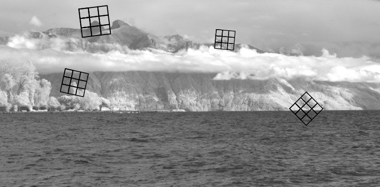

## Multispectral Interest Points for RGB-NIR Image Registration

[Project report](https://github.com/downloads/damienfir/damienfir.github.com/firmenich_feature_detection_nir2011.pdf)

[Paper ICIP 2011](https://github.com/downloads/damienfir/damienfir.github.com/icip2011.pdf)
[Slides ICIP 2011](https://github.com/downloads/damienfir/damienfir.github.com/icip.pdf)

---

